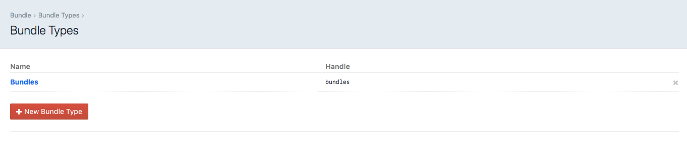
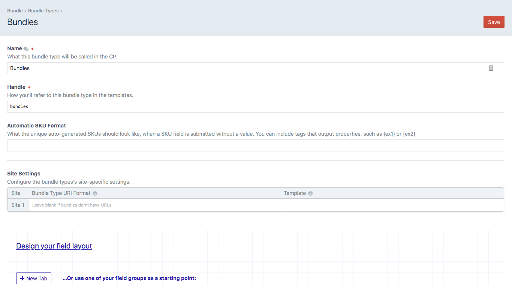
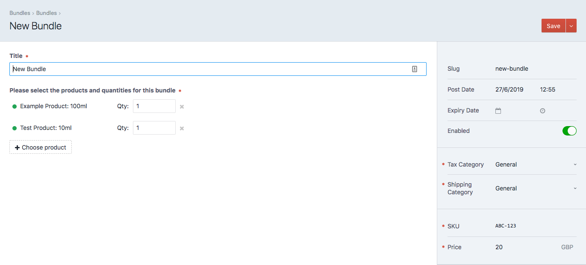
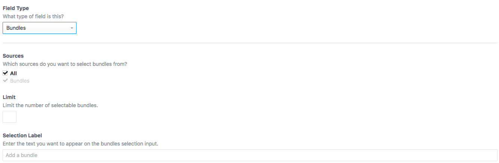

# Bundles plugin for Craft CMS 3.x

Create a bundle purchasable of existing commerce products.

## Requirements

This plugin requires Craft CMS 3.0.0-beta.23 or later.

## Installation

To install the plugin, follow these instructions.

1. Open your terminal and go to your Craft project:

        cd /path/to/project

2. Then tell Composer to load the plugin:

        composer require kuriousagency/commerce-bundles

3. In the Control Panel, go to Settings → Plugins and click the “Install” button for Bundles.

## Bundles Overview

Bundles allows you to create a bundle containing a combination of different products (or a single product with multiple quantities). Set an overall price for the bundle, giving you the option to offer a discount or promotion (for example 3 for 2).

## Configuring Bundles

**Bundle Types**

Bundle Types is where you can define the template and URL for bundle. You can add any custom fields to your bundle types.





**Bundles**

Here is where you setup your Bundle, select the products and quantities of the product that make up the Bundle. Similar to Commerce Products add an SKU and price for the Bundle.



## Using Bundles

You can access your bundles from your templates using a bundle query:

```twig

```

When you access a bundle directly via it's URL the `bundle` variable is available.

***

**Available Methods**

Once you have your bundle there are methods for accessing the bundles products and quanities, and for checking stock.

*Products*

```twig
{# Returns an array of the bundles products (Commerce Variant object) #}

bundle.getProducts()
```

*Quantities*

```twig
{# Returns an array of quantites with the key set to the variantId #}

bundle.getQtys()
```

*Stock*

```twig
{# checks to see if all the products in the bundle have stock #}

bundle.hasStock()
```
***

**Fields**

Bundles also includes a *Bundles* field type.



## Example

Display a list of products and quantities that make up the bundle.

```twig

   {{ qty ~ ' x ' ~ craft.variants.id(id).one.description }}

```
Brought to you by [Kurious Agency](https://kurious.agency)